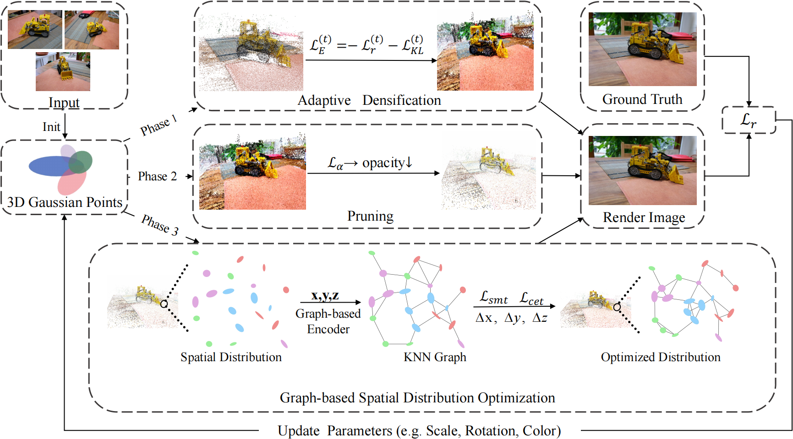

# GS^2: Graph-based Spatial Distribution Optimization for Compact 3D Gaussian Splatting


This repository is an official implementation of the paper [ GS^2: Graph-based Spatial Distribution Optimization for Compact 3D Gaussian Splatting]().


## Introduction

3D Gaussian Splatting (3DGS) has demonstrated breakthrough performance in novel view synthesis and real-time rendering.   Nevertheless, its practicality is constrained by the high memory cost due to a huge number of Gaussian points.   Many pruning-based 3DGS variants have been proposed for memory saving, but often compromise spatial consistency and may lead to rendering artifacts. To address this issue, we propose graph-based spatial distribution optimization for compact 3D Gaussian Splatting (GS\textasciicircum2), which enhances reconstruction quality by optimizing the spatial distribution of Gaussian points. Specifically, we introduce an evidence lower bound (ELBO)-based adaptive densification strategy that automatically controls the densification process. In addition, an opacity-aware progressive pruning strategy is proposed to further reduce memory consumption by dynamically removing low-opacity Gaussian points. Furthermore, we propose a graph-based feature encoding module to adjust the spatial distribution via feature-guided point shifting.  Extensive experiments validate that GS\textasciicircum2 achieves a compact Gaussian representation while delivering superior rendering quality. Compared with 3DGS, it achieves higher PSNR with only about 12.5\% Gaussian points. Furthermore, it outperforms all compared baselines in both rendering quality and memory efficiency.  

<br/>
<div align="center">
  

  Fig. 1: Overall architecture of the proposed GS^2 model.
</div>


## Getting Started 

Our code is based on the excellent official repo for [3D Gaussian Splatting](https://github.com/graphdeco-inria/gaussian-splatting/tree/main). 

## Training

Modify the paths to dataset and output folder in the ```run.sh``` script. 

```shell

cd gaussian-splatting
bash run.sh
```

## Pre-trained Models
Trained models are now available [here](https://drive.google.com/file/d/1UWPlaA02wXMosi5o1cHjHDZ-8huE34WP/view?usp=drive_link). You can download these models and provide the paths in the render and evaluation codes to get the metrics. The metrics might not exactly match those in the paper since these are re-runs with different seeds.


## Citing GS^2
If you find GS^2 useful in your research, please consider citing:
```bibtex
@article{yang2026gs2graphbasedspatialdistribution,
   title={GS^2: Graph-based Spatial Distribution Optimization for Compact 3D Gaussian Splatting}, 
      author={Xianben Yang, Tao Wang , Yuxuan Li, Yi Jin and Haibin Ling},
      year={2026},
      eprint={2604.01884}
}
```


## Acknowledgement
This code is developed on [gaussian-splatting](https://github.com/graphdeco-inria/gaussian-splatting). 

## License

This repository is released under the Apache 2.0 license. Please see the [LICENSE](./LICENSE) file for more information.
